Input method smoke test. VS Code is powered by [Monaco](https://github.com/Microsoft/monaco-editor), a browser based code editor which supports IE 9/10/11, Edge, Chrome, Firefox, Safari and Opera, so when we make changes to the editor part, we should make sure it still works on all browsers Monaco support.

The golden standard is Word

# Table of Contents

 * [[Windows/Mac] Japanese](#windowsmac-japanese)
 * [[Windows] Korean](#windows-korean)
 * [[Windows] Vietnamese with UniKey](#windows-vietnamese-with-unikey)
 * [[Windows] Chinese](#windows-chinese)
 * [[Windows] Sogou pinyin Chinese input method](#windows-sogou-pinyin-chinese-input-method)
 * [[Mac] Zhuyin Input Method (Chinese)](#mac-zhuyin-input-method-chinese)
 * [[Linux] Japanese](#linux-japanese)
 * [[Linux] Korean (Hangul)](#linux-korean)
 * [[Linux] Chinese (Pinyin)](#linux-chinese-pinyin)
 * [[Linux] Chinese (Sogou Pinyin)](#linux-chinese-sogou-pinyin)

---
## [Windows/Mac] Japanese

* Add the Japanese input method
  * Windows: `Settings > Time & Language > Region & language > Add a language > Japanese`
  * Mac: `Settings > Keyboard > Input Sources > Add a language > Japanese`

* Focus VS Code and switch OS input method to Japanese and choose Hiragana:
  * Windows:  
  * Mac: Choose Hiragana in the menu bar

* Type the following words: `sennsei` or `konnnichiha` or `mikann` followed by the enter key. Here is how Word looks like doing this:
  * `sennsei` should result in "せんせい" or "先生"
  * `konnnichiha` should result in "こんにちは"
  * `mikann` should result in "みかん" or "蜜柑"

  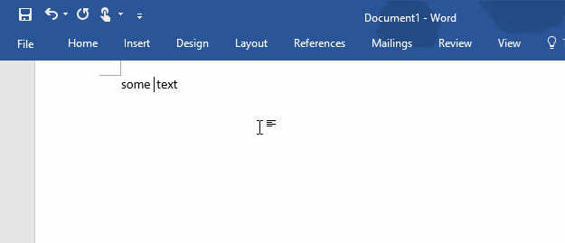

* After typing some Japanese words, try to type space or enter key a few times to see if the composition works correctly.
  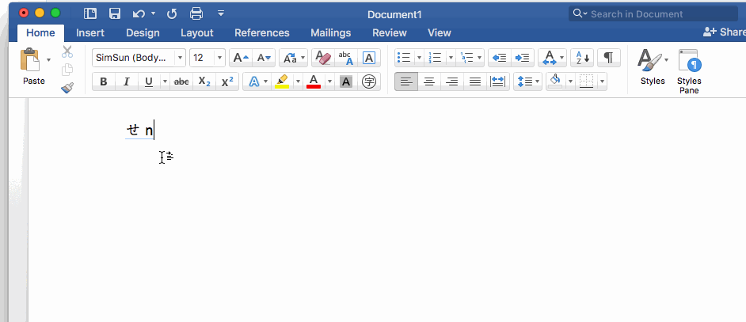

---
## [Windows] Korean

* Add the Korean input method
  * `Settings > Time & Language > Region & language > Add a language > Korean`

* Focus VS Code and switch OS input method to Korean and choose Hangul:

  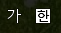

* Type `gksrmf` and press space. Here is how Word looks like doing this (it should be "한글"):

  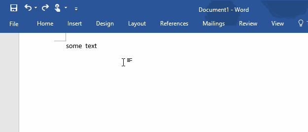

* Type `dkssudgktpdy` in a new file. Here is how Word looks like doing this:

  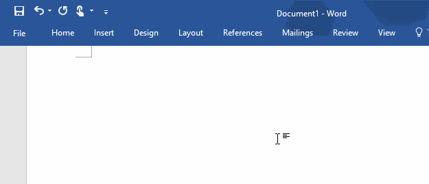

* Type `dks`, it should be read `안`. Now backspace should result in `아`, backspace again should result in `ㅇ`

---
## [Windows] Vietnamese with UniKey
* Download and Run [UniKey](http://www.unikey.org/bdownload.php#uk)

* Click the button with a down arrow:

  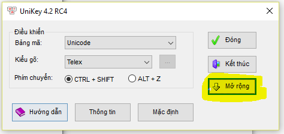

* Get the following settings:

  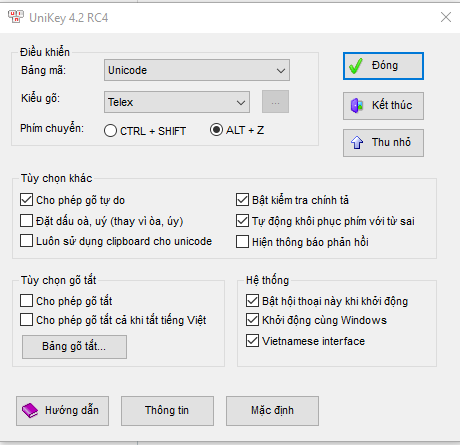

* Focus VS Code and click once UniKey's system tray entry (next to the date) to toggle on Vietnamese mode (get it to be a V):

  

* Type `Tooi` => it should transform to => Tôi. Here is how Word looks like doing this:

  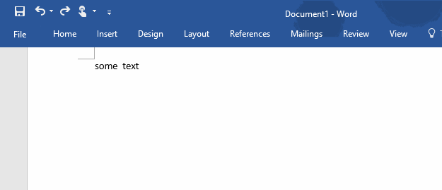

---
## [Windows] Chinese
* Add the Chinese (Simplified) input method
 * `Settings > Time & Language > Region & language > Add a language > Chinese (Simplified)`

* Focus VS Code and switch OS input method to Chinese and choose Chinese mode and make sure the input method's name is Microsoft Pinyin:

  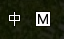

* Type `.` or `,` in full width form. They should be typed in immediately. Here is how Word looks like doing this:

  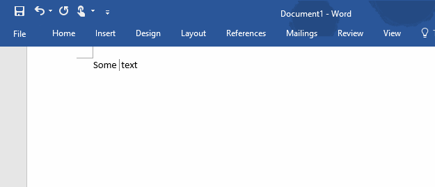

* Type `ni` press `Space` and then `hao` and press `Space`. They should be typed in immediately. Here is how Word looks like doing this:

  

* Type `hazni` press `Space`. It should result into `哈祝你` or `汉子` or `哈子你`. The result might differ due to different implementation of the algorithm the IME uses, just make sure it's the same as what you get in Notepad or whatever.

* Type `a` and press space key twice. The result should be `啊 `(Please note it ends with a single space)。

--
## [Windows] Sogou pinyin Chinese input method
* Install Sogou pinyin Chinese input method

  * Download Sogou pinyin Chinese input method from [this link](http://pinyin.sogou.com/)

    

  * Double click downloaded install exe

    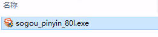

  * Click YES if UAC dialog show  

    

  * Click Install immediately in the install UI

    

  * Wait for the process complete, UNCHECK the "install the Sogou browser"  

    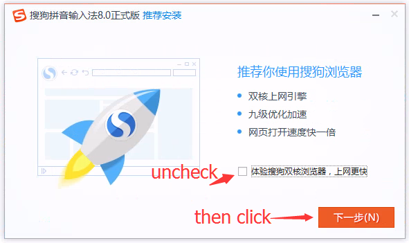

  * Uncheck all options, click finish  

    

* Focus VS Code and switch OS input method to Chinese and choose Chinese mode and make sure the input method's name is Sogou Pinyin:

  

* Type `ni` press `Space` and then `hao` and press `Space`. They should be typed in immediately. Here is how Word looks like doing this: 

  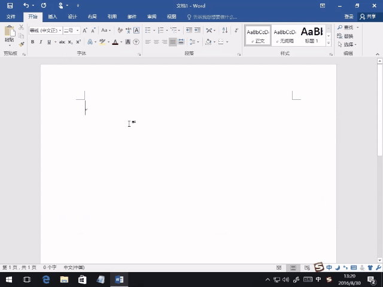

* It should result into `你好`

---
## [Mac] Zhuyin Input Method (Chinese)
* `System Preferences > Keyboard > Input Sources > Add > Chinese, Tranditional > Zhuyin`

  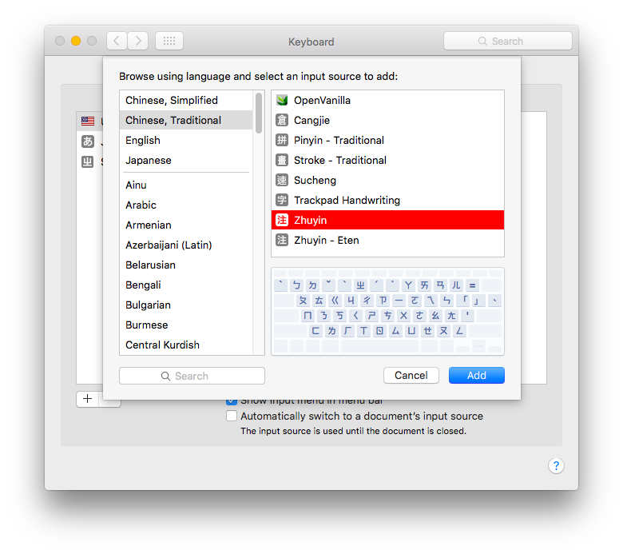

* Focus VS Code and switch OS input method to Zhuyin (press Command + space)

  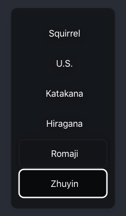

* Type `su3cl3` and press Enter. Here is how World looks like doing this (It should be "你好")

  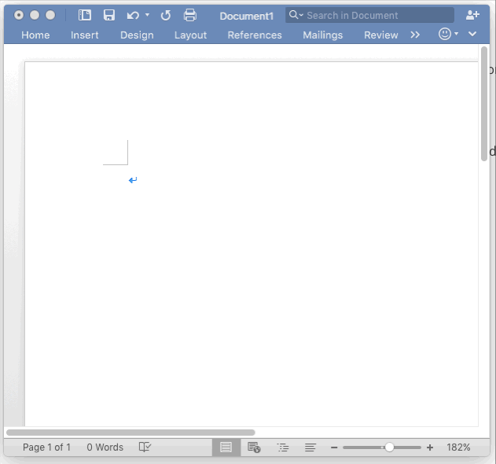

---
## [Mac] The hold input method
* Long press `e`
* A pop-up should appear
* Choose a different variant, like an `e` with an accute accent

---
## [Mac] The emoji inserter

---
## [Linux] Japanese
Use [mozc](https://wiki.archlinux.org/index.php/Mozc).

### Ubuntu

Follow [this guide](https://moritzmolch.com/1453), from the **Mozc** section:

- `sudo apt-get install ibus-mozc`
- `System Settings > Text Entry`, add `Japanese (Mozc)(IBus)` to the list
- In the system menu bar, switch the input language to Mozc and the input mode to Hiragana

### Elementary OS

http://elementaryos.stackexchange.com/questions/271/how-can-i-enable-japanese-input

### Test

| Input  | Output  |
|---|---|
| `sennsei`  | "せんせい" or "先生"  |
|  `konnnichiha` |  "こんにちは" |
| `mikann`  |   "みかん" or "蜜柑" |

## [Linux] Korean

### Ubuntu

* guide: https://10wontips.blogspot.com/2019/03/typing-in-korean-on-lubuntu-1810.html
* Follow [this guide](http://ubuntuhandbook.org/index.php/2016/07/2-best-chinese-pinyin-im-ubuntu-16-04/) to install and setup fcitx.

### Elementary OS

* Install fcitx: Follow instructions [here](https://www.reddit.com/r/elementaryos/comments/33cfha/multiple_inputs_under_freya_chinese_case_pinyin/)
* Install Korean-Hangul support: `sudo apt-get install fcitx-hangul`

### Test

| Input  | Output  |
|---|---|
| `gksrmf`  | "한글"  |

## [Linux] Chinese (Pinyin)

### Ubuntu

* Follow [this guide](http://ubuntuhandbook.org/index.php/2016/07/2-best-chinese-pinyin-im-ubuntu-16-04/) to install and setup fcitx.

### Elementary OS

* Install fcitx: Follow instructions [here](https://www.reddit.com/r/elementaryos/comments/33cfha/multiple_inputs_under_freya_chinese_case_pinyin/)
* Select Google Pinyin

### Test

| Input  | Output  |
|---|---|
| `ni` <kbd>Space</kbd> `hao` <kbd>Space</kbd>  | "你好"  |

## [Linux] Chinese (Sogou Pinyin)

* Install fcitx as above
* Install the deb images (32/64 bit) from http://pinyin.sogou.com/linux/?r=pinyin

### Test

| Input  | Output  |
|---|---|
| `ni` <kbd>Space</kbd> `hao` <kbd>Space</kbd>  | "你好"  |

---

Content created from:
* [#1168](https://github.com/Microsoft/vscode/issues/1168)
* [#2250](https://github.com/Microsoft/vscode/issues/2250)
* [#2374](https://github.com/Microsoft/vscode/issues/2374)
* [#5615](https://github.com/Microsoft/vscode/issues/5615)
* [#7997](https://github.com/Microsoft/vscode/issues/7997)
* [#10937](https://github.com/Microsoft/vscode/issues/10937)