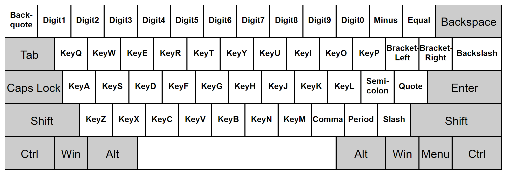
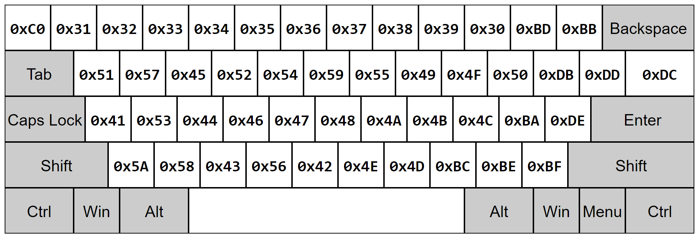
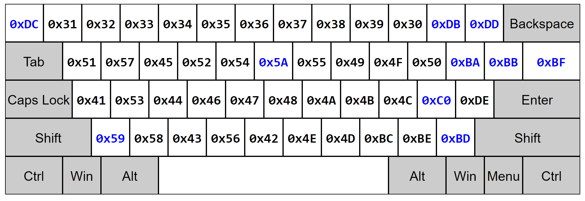
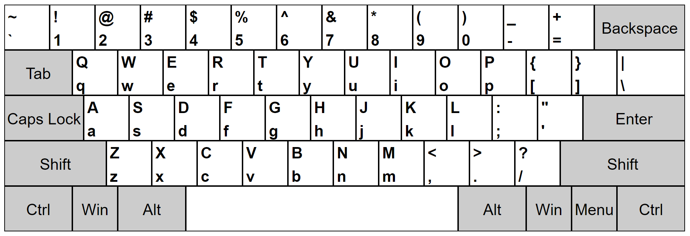
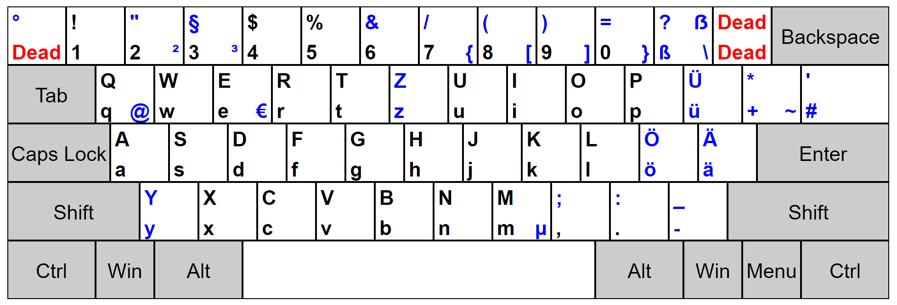
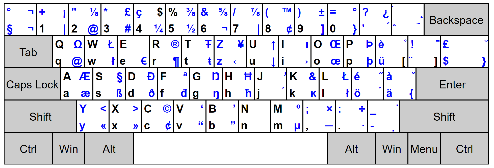

# Summary

This page documents workarounds for known issues related to VS Code keybindings and explains how VS Code handles keybindings and why it does what it does for the curious.

## TOC
  * [Basic Troubleshooting](#basic-troubleshooting)
  * Quick troubleshoot
    * [Troubleshoot keybindings on Linux](#troubleshoot-linux-keybindings)
    * [Troubleshoot keybindings on Mac](#troubleshoot-mac-keybindings)
    * [Troubleshoot keybindings on Windows](#troubleshoot-windows-keybindings)
    * [Troubleshoot generic keybindings](#troubleshoot-generic-keybindings)
  * e.code, e.keyCode and e.key
  * How it works on Windows
  * How it works on macOS/Linux
  * Deciphering keybindings.json

## Troubleshoot

### Basic Troubleshooting

  * Run the command `Developer: Toggle Keyboard Shortcuts Troubleshooting`
    * This will activate logging of dispatched keyboard shortcuts and will open an output panel with the corresponding log file.
  * You can then press your desired keybinding and check what keyboard shortcut VS Code detects and what command is invoked.

For example, when pressing `cmd+/` in a code editor on macOS, the logging output would be:

```
[KeybindingService]: / Received  keydown event - modifiers: [meta], code: MetaLeft, keyCode: 91, key: Meta
[KeybindingService]: | Converted keydown event - modifiers: [meta], code: MetaLeft, keyCode: 57 ('Meta')
[KeybindingService]: \ Keyboard event cannot be dispatched.
[KeybindingService]: / Received  keydown event - modifiers: [meta], code: Slash, keyCode: 191, key: /
[KeybindingService]: | Converted keydown event - modifiers: [meta], code: Slash, keyCode: 85 ('/')
[KeybindingService]: | Resolving meta+[Slash]
[KeybindingService]: \ From 2 keybinding entries, matched editor.action.commentLine, when: editorTextFocus && !editorReadonly, source: built-in.
```

The first keydown event is for the `MetaLeft` key (`cmd`) and cannot be dispatched. The second keydown event is for the `Slash` key (`/`) and is dispatched as `meta+[Slash]`. There were two keybinding entries mapped from `meta+[Slash]` and the one that matched was for the command `editor.action.commentLine`, which has the `when` condition `editorTextFocus && !editorReadonly` and is a built-in keybinding entry.


### Troubleshoot Linux Keybindings

  * Are you connecting to the Linux machine via some form of virtualization or remote desktop software?
    * **symptoms**: e.g. pressing <kbd>AltGr</kbd> acts as `Backspace`, pressing <kbd>C</kbd> acts as `ArrowLeft`, etc.
    * **solution**: use `"keyboard.dispatch": "keyCode"` in your settings and restart VS Code.
    * **explanation**: VS Code on Linux dispatches keybindings using scan codes to accomodate various keyboard layouts. This works well when sitting physically at the machine and the OS is the one creating keyboard events, but some virtualization / remote desktop software creates keyboard events with incorrect scan codes.

  * Are you switching keyboard layouts while VS Code is running?
    * **symptoms**: VS Code keybindings reflect the keyboard layout that was active when VS Code was launched.
    * **solution 1**: Reload VS Code after switching keyboard layouts. <kbd>F1</kbd> `> Reload Window`
    * **solution 2**: Define your own custom keybindings based on scan codes. e.g. `"key": "ctrl+[Backquote]"` will always be the same physical key irrespective of keyboard layouts.
    * **explanation**: VS Code on Linux **does not** detect switching the keyboard layout. We have an [open feature request and a PR is welcome - #23690](https://github.com/Microsoft/vscode/issues/23690)

  * Are you using multiple keyboard layouts?
    * **NOTE**: this will be fixed starting with VS Code 1.62.0 and the fix will be available in Insiders starting Oct 13th 2021.
    * **symptoms**: VS Code keybindings reflect a keyboard layout that I have installed, but not the active one.
    * **solution 1**: make sure `setxkbmap -query` returns as the first keyboard layout the one you want to work with in VS Code.
    * **solution 2**: use `"keyboard.dispatch": "keyCode"` in your settings and restart VS Code. This will prevent VS Code from trying to determine your keyboard layout whatsoever.
    * **explanation**: Switching keyboard layouts under some Linux window managers does not result in a change in the low level X window APIs VS Code uses to read the current keyboard layout. This means that VS Code ends up sometimes reading one of the other configured keyboard layouts and not the current active one. PR welcome: [#23505](https://github.com/Microsoft/vscode/issues/23505), [#24166](https://github.com/Microsoft/vscode/issues/24166)

  * Are you customizing keyboard mappings via `setxkbmap` or equivalents?
    * **symptoms**: customizations done via `setxkbmap` or equivalents have no effect in VS Code.
    * **solution**: use `"keyboard.dispatch": "keyCode"` in your settings and restart VS Code.
    * **explanation**: VS Code does not honour keyboard mappings at this time when determining what scan codes it should listen for. [Ideas and PR welcome - #23991](https://github.com/Microsoft/vscode/issues/23991)

  * Are you using some keyboard layout that remaps more than the printable characters?
    * **symptoms**: e.g. the Neo keyboard layout does not work entirely in VS Code.
    * **solution**: use `"keyboard.dispatch": "keyCode"` in your settings and restart VS Code. This will prevent VS Code from trying to determine your keyboard layout whatsoever.
    * **explanation**: VS Code only looks at scan codes that usually produce printable characters in determining what scan codes to listen to. [Ideas and PR welcome - #24043](https://github.com/Microsoft/vscode/issues/24043)

  * An important action is not mapped to a good keybinding by default.
    * **symptoms**: e.g. the Toggle Integrated Terminal action has no default keybinding on the Ukrainian keyboard layout, the Comment Line action is bound to <kbd>Ctrl+Shift+7</kbd> on the German keyboard layout.
    * **solution**: use the Keybinding UI or `keybindings.json` file to define a custom keybinding that suits your needs.
    * **explanation**: VS Code does not ship with default keybindings optimized per keyboard layout. For example, <kbd>Ctrl+\`</kbd> cannot be mapped by VS Code automatically to a scan code on the Ukrainian keyboard layout because no modifier + scan code combination produces <kbd>\`</kbd> on the Ukrainian keyboard layout. You can upvote in [issue #1240](https://github.com/Microsoft/vscode/issues/1240).

  * Is <kbd>Ctrl</kbd>+<kbd>.</kbd> inserting a small `e` when running with kde desktop and ibus-daemon?
    * **symptoms**: pressing <kbd>Ctrl</kbd>+<kbd>.</kbd> inserts a small `e` instead of triggering quick fix.
    * **solution**: if you disable emoji shortcuts from ibus-daemon (run "ibus-setup" to show ibus preferences), the shortcut for Quick Fix <kbd>Ctrl</kbd>+<kbd>.</kbd> works again. Special thanks to [danjaredg](https://github.com/danjaredg) for [pointing this out](https://github.com/microsoft/vscode/issues/142583)

  * Experiencing any other issue?
    * **try**: use `"keyboard.dispatch": "keyCode"` in your settings and restart VS Code.
    * **further troubleshooting**: [Troubleshoot generic keybindings](#troubleshoot-generic-keybindings)

### Troubleshoot Mac Keybindings

  * Are you using a custom installed keyboard layout with its own sub-layouts?
    * **symptoms**: changing the sub-layout to Dvorak - QWERTY ⌘ in the custom Chinese pinyin layout is not reflected in VS Code
    * **solution**: use `"keyboard.dispatch": "keyCode"` in your settings and restart VS Code.
    * **explanation**: using custom keyboard layouts with their own sub-layouts cannot be detected by VS Code because the keyboard layout reports the same identifier when the sub-layout is changed.

  * Are you using an external ISO keyboard attached to a laptop with an ANSI keyboard?
    * **symptoms**: `[Backquote]` and `[IntlBackslash]` are "swapped".
    * **solution**: press a key on the keyboard you want to use. Wait up to 3s and VS Code should catch up.
    * **explanation**: On ISO keyboards, macOS swaps the scan codes for `[Backquote]` and `[IntlBackslash]`. We respect this swapping. However, Chromium, in order to stay W3C spec compliant, decided to unswap the two scan codes. We cannot detect when Chromium unswaps the scan codes on a keyboard event basis, we need to poll and check if the last keyboard event came from an ISO keyboard and then expect that Chromium swaps the scan codes such that we can un-un-swap them. [Read more in issue #26506](https://github.com/Microsoft/vscode/issues/26506)

  * Are you using some keyboard layout that remaps more than the printable characters?
    * **symptoms**: e.g. the Neo keyboard layout does not work entirely in VS Code.
    * **solution**: use `"keyboard.dispatch": "keyCode"` in your settings and restart VS Code. This will prevent VS Code from trying to determine your keyboard layout whatsoever.
    * **explanation**: VS Code only looks at scan codes that usually produce printable characters in determining what scan codes to listen to. [Ideas and PR welcome - #24043](https://github.com/Microsoft/vscode/issues/24043)

  * An important action is not mapped to a good keybinding by default.
    * **symptoms**: e.g. the Toggle Integrated Terminal action has no default keybinding on the Ukrainian keyboard layout, the Comment Line action is bound to <kbd>Ctrl+Shift+7</kbd> on the German keyboard layout.
    * **solution**: use the Keybinding UI or `keybindings.json` file to define a custom keybinding that suits your needs.
    * **explanation**: VS Code does not ship with default keybindings optimized per keyboard layout. For example, <kbd>Ctrl+\`</kbd> cannot be mapped by VS Code automatically to a scan code on the Ukrainian keyboard layout because no modifier + scan code combination produces <kbd>\`</kbd> on the Ukrainian keyboard layout. You can upvote in [issue #1240](https://github.com/Microsoft/vscode/issues/1240).

  * Experiencing any other issue?
    * **try**: use `"keyboard.dispatch": "keyCode"` in your settings and restart VS Code.
    * **further troubleshooting**: [Troubleshoot generic keybindings](#troubleshoot-generic-keybindings)

### Troubleshoot Windows Keybindings

  * An important action is not mapped to a good keybinding by default.
    * **symptoms**: e.g. an important action has no keybinding on a specific keyboard layout out of the box or it is an unfortunate one.
    * **solution**: use the Keybinding UI or `keybindings.json` file to define a custom keybinding that suits your needs.
    * **explanation**: VS Code does not ship with default keybindings optimized per keyboard layout. Keyboard layouts under Windows are free to more, remove, or add a set of key codes and it is possible that under your keyboard layout a specific key code, e.g. `VK_OEM_3` is not used. You can upvote in [issue #1240](https://github.com/Microsoft/vscode/issues/1240).

  * Experiencing any other issue?
    * **further troubleshooting**: [Troubleshoot generic keybindings](#troubleshoot-generic-keybindings)

### Troubleshoot generic Keybindings

  * When I press a key combination, VS Code does not react
    * **symptoms**: e.g. <kbd>Ctrl+Alt+Up</kbd> does not add a cursor up, it rotates the screen.
    * **solution**: check what key combination we receive from the OS. If we don't receive a good key combination, you need to configure your OS or drivers to release that key combination to applications. e.g.:
   

  * A keybinding does something unexpected.
    * **symptoms**: e.g. <kbd>Cmd+Q</kbd> does not quit on mac.
    * **solution**: identify and remove the keybinding rule that runs on that specific keypress. run `code --disable-extensions` or try to identify the keybinding rule that you don't like and remove it via the Keybindings UI or via editing directly `keybindings.json`. The keybindings contributed by extensions are always near the bottom of the Default keybindings.json file.
    * **explanation**: VS Code extensions can overwrite the defaults VS Code ships with. We do our best to present only valid keybindings in dialogs and hovers, but sometimes a keybinding rule contributed by an extension *shadows* a built-in rule in a certain context.

  * I cannot type a character via <kbd>AltGr+[Key]</kbd> or <kbd>Alt+[Key]</kbd> or <kbd>Ctrl+Alt+[Key]</kbd>
    * **symptoms**: e.g. I cannot type `[` via <kbd>AltGr+8</kbd> on the German keyboard layout.
    * **solution**: identify and remove the keybinding rule that runs on that specific keypress. run `code --disable-extensions` or try to identify the keybinding rule that you don't like and remove it via the Keybindings UI or via editing directly `keybindings.json`. The keybindings contributed by extensions are always near the bottom of the Default keybindings.json file. e.g. `{ "key": "ctrl+alt+8" }` in `keybindings.json` will completely free up that keypress.
    * **explanation**: VS Code does not contain default keybindings that are of the form <kbd>Ctrl+Alt+[Key]</kbd> on Windows, since these might produce vital characters. Some extensions, however, do not do so. You are in total control of the keybinding rules and you can remove the ones you don't want.


  * I want to find out which commands are bound to a key combination.
  

  * I have tried **all of the above**
    * open an editor.
    * Run <kbd>F1</kbd> `> Developer: Inspect key mappings`
    * save the output to a file
    * open an issue and explain thoroughly your setup and attach the file.

---

This guide will explain how VS Code handles keybindings and guide you through identifying keybindings issues (especially related to different keyboard layouts).

Please take the time to read through this detailed explanation before proceeding to troubleshooting.

## `e.code`, `e.keyCode` and `e.key`

Here is an example for `e.code`, `e.keyCode` and `e.key` values on Chromium, on Windows:

<table>

<tr>
<th>Windows US standard kb layout</th>
<th>Windows GER Germany kb layout</th>
</tr>

<tr>
<td colspan="2"><code>e.code: string</code></td>
</tr>
<tr>
<td><a target="_blank" href="images/keyboard/scan_en_us.png"></a></td>
<td><a target="_blank" href="images/keyboard/scan_de_de.png"></a></td>
</tr>

<tr>
<td colspan="2"><code>e.keyCode: number</code></td>
</tr>
<tr>
<td><a target="_blank" href="images/keyboard/keycode_en_us.png"></a></td>
<td><a target="_blank" href="images/keyboard/keycode_de_de.png"></a></td>
</tr>

<tr>
<td colspan="2"><code>e.key: string</code></td>
</tr>
<tr>
<td><a target="_blank" href="images/keyboard/key_en_us.png"></a></td>
<td><a target="_blank" href="images/keyboard/key_de_de.png"></a></td>
</tr>

</table>


Windows was chosen as an example because Windows is the only platform where `e.keyCode` has an actual correspondent at the Operating System level. More specifically, on Windows:

* `e.code` is the equivalent of Windows **scan codes**.
* `e.keyCode` is the equivalent of Windows **virtual-keys**.
* `e.key` is the **mostly** produced character, except for dead keys, where it has the value `Dead`.

**Keyboard layouts under Windows consist of two mappings**:
* the first one maps scan codes to virtual keys. For example, that is how <kbd>Z</kbd> and <kbd>Y</kbd> are swapped on the GER keyboard layout.
* the second one maps virtual keys and modifiers to produced characters. For example, <kbd>Shift+0x37</kbd> produces `&` on the US keyboard layout, while <kbd>Shift+0x37</kbd> produces `/` on the GER keyboard layout.

Read more about how keyboard layouts work under Windows
[here](https://msdn.microsoft.com/en-us/library/windows/desktop/ms646267(v=vs.85).aspx).

### What's wrong with `e.code`

There's nothing wrong per-se, except, under Windows, all desktop applications that I could test dispatch on `e.keyCode`, i.e. it would be "non-native" for VS Code to dispatch on `e.code` on Windows.

### What's wrong with `e.keyCode`

macOS and Linux do not have an Operating System level correspondant for `e.keyCode`. **Keyboard layouts on macOS and Linux consist of a single mapping**. Chromium does a somewhat decent job at coming up with values for `e.keyCode`, but all the values are fabricated, and **any piece of code that ends up depending on `e.keyCode` will ultimately be incorrect on various keyboard layouts on macOS/Linux**.

### What's wrong with `e.key`

In some circumstances (i.e. combining accents), `e.key` has the value `Dead`. We cannot dispatch on `e.key` because the keys that produce combining accents would be unmappable in VS Code.

Moreover, it is not possible to correlate modifier keys, `e.code` and `e.key` in any meaningful way without additional information. e.g.

* pressing <kbd>Ctrl+Alt+Digit7</kbd> results in `ctrlKey: true, altKey: true, key: "{"`
* pressing <kbd>Ctrl+Alt+Digit6</kbd> results in `ctrlKey: true, altKey: true, key: "6"`
* there is no way to determine that <kbd>Ctrl+Alt+</kbd> were "consumed" in producing `{` and were not "consumed" in producing `6`.

### To sum up

**On Windows, VS Code dispatches on `e.keyCode`**.

**On macOS and Linux, VS Code dispatches on `e.code`**.

---

## How it works on Windows

All built-in commands, extensions and user settings register keybindings in terms of `keyCode`. All Electron APIs (i.e. menus) refer to keybindings in terms of `keyCode`. The only special thing to do here is to be sure to present good labels in the UI to end-users.

For example, the `Toggle Line Comment` action is bound to <kbd>Ctrl+0xBF</kbd>:

| Kb Layout | Scan Code | Virtual Key | Produced Character |
|---|---|---|---|
| US | `[Slash]` | `0xBF` | `/`
| GER | `[Backslash]` | `0xBF` | `#`

Therefore, the keybinding for `Toggle Line Comment` should be rendered as <kbd>Ctrl+/</kbd> on a US keyboard layout and as <kbd>Ctrl+#</kbd> on a GER keyboard layout. This is done by using the native node module `native-keymap`. It gives the virtual key and the produced characters for each scan code. e.g.:

```js
Backslash: {
   vkey: "VK_OEM_2", // well known name given to 0xBF
   value: "#",
   withShift: "'",
   withAltGr: "",
   withShiftAltGr: ""
}
```

### Code pointers
* [`node-native-keymap`](https://github.com/Microsoft/node-native-keymap/blob/master/src/keyboard_win.cc)
* [`WindowsKeyboardMapper`](https://github.com/Microsoft/vscode/blob/master/src/vs/workbench/services/keybinding/common/windowsKeyboardMapper.ts)

## How it works on macOS/Linux

All built-in commands, extensions and user settings register keybindings in terms of `keyCode`. Therefore, the immediate thing to do here is to transform these keybindings in terms of `code`. This is done with an heuristic based on the produced characters.


<table>

<tr>
<th>Linux US standard kb layout</th>
<th>Linux GER Switzerland kb layout</th>
</tr>

<tr>
<td><a target="_blank" href="images/keyboard/scan_en_us.png"></a></td>
<td><a target="_blank" href="images/keyboard/scan_de_de.png"></a></td>
</tr>

<tr>
<td><a target="_blank" href="images/keyboard/key_en_us.png"></a></td>
<td><a target="_blank" href="images/keyboard/key_de_ch.png"></a></td>
</tr>

</table>

For example, the `Toggle Line Comment` action is bound to <kbd>Ctrl+0xBF</kbd>, which would produce `/` under the US standard keyboard layout:

| Kb Layout | Scan Code | Virtual Key | Produced Character |
|---|---|---|---|
| US | `[Slash]` | `0xBF` | `/`
| GER (CH) | `Shift+[Digit7]` | `0xBF` | `/`

Therefore, under the US keyboard layout, the action is bound to <kbd>Ctrl+/</kbd>, while on the GER (CH) keyboard layout it is bound to <kbd>Ctrl+Shift+Digit7</kbd>. This is done by using the native node module `native-keymap`. It gives the produced characters for each scan code. e.g.:


```js
Digit7: {
   value: "7",
   withShift: "/",
   withAltGr: "|",
   withShiftAltGr: "⅞"
}
```

Since Electron APIs (i.e. menus) refer to keybindings based on `keyCode`, we cannot expose the keybindings to Electron in all circumstances.

If the native node module fails to run (i.e. the mappings cannot be obtained), keybinding dispatching falls back to using `e.keyCode`.

### Code pointers
* [`node-native-keymap`](https://github.com/Microsoft/node-native-keymap/blob/master/src/keyboard_x.cc)
* [`node-native-keymap`](https://github.com/Microsoft/node-native-keymap/blob/master/src/keyboard_mac.mm)
* [`MacLinuxKeyboardMapper`](https://github.com/Microsoft/vscode/blob/master/src/vs/workbench/services/keybinding/common/macLinuxKeyboardMapper.ts)

---

## Deciphering `keybindings.json`

Most of the keybindings serialized in `keybindings.json` refer to `e.keyCode`. Here is the table to figure them out:

| `keybindings.json` | Key Code Name | Key Code Value |
|----------|----------|--------|
| <kbd>;</kbd> | <kbd>VK_OEM_1</kbd> | `0xBA` |
| <kbd>=</kbd> | <kbd>VK_OEM_PLUS</kbd> | `0xBB` |
| <kbd>,</kbd> | <kbd>VK_OEM_COMMA</kbd> | `0xBC` |
| <kbd>-</kbd> | <kbd>VK_OEM_MINUS</kbd> | `0xBD` |
| <kbd>.</kbd> | <kbd>VK_OEM_PERIOD</kbd> | `0xBE` |
| <kbd>/</kbd> | <kbd>VK_OEM_2</kbd> | `0xBF` |
| <kbd>\`</kbd> | <kbd>VK_OEM_3</kbd> | `0xC0` |
| <kbd>[</kbd> | <kbd>VK_OEM_4</kbd> | `0xDB` |
| <kbd>\\</kbd> | <kbd>VK_OEM_5</kbd> | `0xDC` |
| <kbd>]</kbd> | <kbd>VK_OEM_6</kbd> | `0xDD` |
| <kbd>'</kbd> | <kbd>VK_OEM_7</kbd> | `0xDE` |
| <kbd>oem_102</kbd> | <kbd>VK_OEM_102</kbd> | `0xE2` |

---
