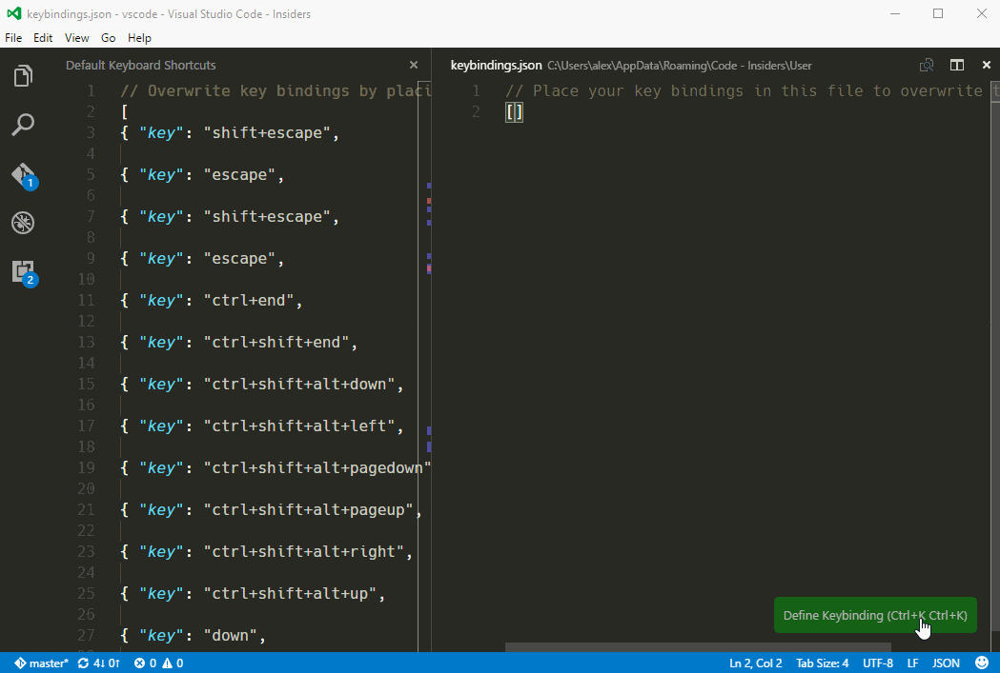

This guide will explain how VS Code handles keybindings and guide you through identifying keybindings issues (especially related to different keyboard layouts).

Please take the time to read through this detailed explanation before proceeding to troubleshooting.

## `e.code`, `e.keyCode` and `e.key`

Here is an example for `e.code`, `e.keyCode` and `e.key` values on Chromium, on Windows:

<table>

<tr>
<th>Windows US standard kb layout</th>
<th>Windows GER Germany kb layout</th>
</tr>

<tr>
<td colspan="2"><code>e.code: string</code></td>
</tr>
<tr>
<td></td>
<td></td>
</tr>

<tr>
<td colspan="2"><code>e.keyCode: number</code></td>
</tr>
<tr>
<td></td>
<td></td>
</tr>

<tr>
<td colspan="2"><code>e.key: string</code></td>
</tr>
<tr>
<td></td>
<td></td>
</tr>

</table>


Windows was chosen as an example because Windows is the only platform where `e.keyCode` has an actual correspondent at the Operating System level. More specifically, on Windows:

* `e.code` is the equivalent of Windows **scan codes**.
* `e.keyCode` is the equivalent of Windows **virtual-keys**.
* `e.key` is the **mostly** produced character, except for dead keys, where it has the value `Dead`.

**Keyboard layouts under Windows consist of two mappings**:
* the first one maps scan codes to virtual keys. For example, that is how <kbd>Z</kbd> and <kbd>Y</kbd> are swapped on the GER keyboard layout.
* the second one maps virtual keys and modifiers to produced characters. For example, <kbd>Shift+0x37</kbd> produces `&` on the US keyboard layout, while <kbd>Shift+0x37</kbd> produces `/` on the GER keyboard layout.

Read more about how keyboard layouts work under Windows
[here](https://msdn.microsoft.com/en-us/library/windows/desktop/ms646267(v=vs.85).aspx).

### What's wrong with `e.code`

There's nothing wrong per-se, except, under Windows, all desktop applications that I could test dispatch on `e.keyCode`, i.e. it would be "non-native" for VS Code to dispatch on `e.code` on Windows.

### What's wrong with `e.keyCode`

OSX and Linux do not have an Operating System level correspondant for `e.keyCode`. **Keyboard layouts on OSX and Linux consist of a single mapping**. Chromium does a somewhat decent job at coming up with values for `e.keyCode`, but all the values are fabricated, and **any piece of code that ends up depending on `e.keyCode` will ultimately be incorrect on various keyboard layouts on OSX/Linux**.

### What's wrong with `e.key`

In some circumstances (i.e. combining accents), `e.key` has the value `Dead`. We cannot dispatch on `e.key` because the keys that produce combining accents would be unmappable in VS Code.

Moreover, it is not possible to correlate modifier keys, `e.code` and `e.key` in any meaningful way without additional information. e.g.

* pressing <kbd>Ctrl+Alt+Digit7</kbd> results in `ctrlKey: true, altKey: true, key: "{"`
* pressing <kbd>Ctrl+Alt+Digit6</kbd> results in `ctrlKey: true, altKey: true, key: "6"`
* there is no way to determine that <kbd>Ctrl+Alt+</kbd> were "consumed" in producing `{` and were not "consumed" in producing `6`.

### To sum up

**On Windows, VS Code dispatches on `e.keyCode`**.

**On OSX and Linux, VS Code dispatches on `e.code`**.

---

## How it works on Windows

All built-in commands, extensions and user settings register keybindings in terms of `keyCode`. All Electron APIs (i.e. menus) refer to keybindings in terms of `keyCode`. The only special thing to do here is to be sure to present good labels in the UI to end-users.

For example, the `Toggle Line Comment` action is bound to <kbd>Ctrl+0xBF</kbd>:

| Kb Layout | Scan Code | Virtual Key | Produced Character |
|---|---|---|---|
| US | `[Slash]` | `0xBF` | `/`
| GER | `[Backslash]` | `0xBF` | `#`

Therefore, the keybinding for `Toggle Line Comment` should be rendered as <kbd>Ctrl+/</kbd> on a US keyboard layout and as <kbd>Ctrl+#</kbd> on a GER keyboard layout. This is done by using the native node module `native-keymap`. It gives the virtual key and the produced characters for each scan code. e.g.:

```js
Backslash: {
   vkey: "VK_OEM_2", // well known name given to 0xBF
   value: "#",
   withShift: "'",
   withAltGr: "",
   withShiftAltGr: ""
}
```

### Code pointers
* [`node-native-keymap`](https://github.com/Microsoft/node-native-keymap/blob/master/src/keyboard_win.cc)
* [`WindowsKeyboardMapper`](https://github.com/Microsoft/vscode/blob/master/src/vs/workbench/services/keybinding/common/windowsKeyboardMapper.ts)

## How it works on OSX/Linux

All built-in commands, extensions and user settings register keybindings in terms of `keyCode`. Therefore, the immediate thing to do here is to transform these keybindings in terms of `code`. This is done with an heuristic based on the produced characters.


<table>

<tr>
<th>Linux US standard kb layout</th>
<th>Linux GER Switzerland kb layout</th>
</tr>

<tr>
<td></td>
<td></td>
</tr>

<tr>
<td></td>
<td></td>
</tr>

</table>

For example, the `Toggle Line Comment` action is bound to <kbd>Ctrl+0xBF</kbd>, which would produce `/` under the US standard keyboard layout:

| Kb Layout | Scan Code combo | Produced Character | Toggle Line Comment |
|---|---|---|---|
| us | `[Slash]` | `/` | `Ctrl+[Slash]`
| ch | `Shift+[Digit7]` | `/` | `Ctrl+Shift+[Digit7]`

Therefore, under the US keyboard layout, the action is bound to `Ctrl+[Slash]`, while on the GER (CH) keyboard layout it is bound to `Ctrl+Shift+[Digit7]`. This is done by using the native node module `native-keymap`. It gives the produced characters for each scan code. e.g.:


```js
Digit7: {
   value: "7",
   withShift: "/",
   withAltGr: "|",
   withShiftAltGr: "⅞"
}
```

Since Electron APIs (i.e. menus) refer to keybindings based on `keyCode`, we cannot expose the keybindings to Electron in all circumstances.

If the native node module fails to run (i.e. the mappings cannot be obtained), keybinding dispatching falls back to using `e.keyCode`.

### Code pointers
* [`node-native-keymap`](https://github.com/Microsoft/node-native-keymap/blob/master/src/keyboard_x.cc)
* [`node-native-keymap`](https://github.com/Microsoft/node-native-keymap/blob/master/src/keyboard_mac.mm)
* [`MacLinuxKeyboardMapper`](https://github.com/Microsoft/vscode/blob/master/src/vs/workbench/services/keybinding/common/macLinuxKeyboardMapper.ts)

---

## Deciphering `keybindings.json`

Most of the keybindings serialized in `keybindings.json` refer to `e.keyCode`. Here is the table to figure them out:

| `keybindings.json` | Key Code Name | Key Code Value |
|----------|----------|--------|
| <kbd>;</kbd> | <kbd>VK_OEM_1</kbd> | `0xBA` |
| <kbd>=</kbd> | <kbd>VK_OEM_PLUS</kbd> | `0xBB` |
| <kbd>,</kbd> | <kbd>VK_OEM_COMMA</kbd> | `0xBC` |
| <kbd>-</kbd> | <kbd>VK_OEM_MINUS</kbd> | `0xBD` |
| <kbd>.</kbd> | <kbd>VK_OEM_PERIOD</kbd> | `0xBE` |
| <kbd>/</kbd> | <kbd>VK_OEM_2</kbd> | `0xBF` |
| <kbd>\`</kbd> | <kbd>VK_OEM_3</kbd> | `0xC0` |
| <kbd>[</kbd> | <kbd>VK_OEM_4</kbd> | `0xDB` |
| <kbd>\\</kbd> | <kbd>VK_OEM_5</kbd> | `0xDC` |
| <kbd>]</kbd> | <kbd>VK_OEM_6</kbd> | `0xDD` |
| <kbd>'</kbd> | <kbd>VK_OEM_7</kbd> | `0xDE` |
| <kbd>oem_102</kbd> | <kbd>VK_OEM_102</kbd> | `0xE2` |

---

## Troubleshooting 1: pressing a key -> running a command

This section describes what to do when you want to press a key on your keyboard and you'd like it to result in a command being executed in VS Code.

**Use the Define Keybinding widget**:

  

## Troubleshooting 2: command -> what key to press

This section describes what to do when you'd like to find out what key a command is bound to. Let's pick Toggle Line Comment (`editor.action.commentLine`) as an example.

#### 1. Find the key code it is bound to out-of-the-box


Go to the default keybindings and find the entry for the command:

```
{ "key": "ctrl+/",  "command": "editor.action.commentLine",
                    "when": "editorTextFocus && !editorReadonly" }
```


Use the above table and deduce that the command is bound to <kbd>Ctrl</kbd> + <kbd>VK_OEM_2</kbd>:

#### 2. Find which key on your keyboard layout is mapped to `VK_OEM_2`

Run `F1 > Developer: Inspect Key Mappings`

Search for `VK_OEM_2` or `Ctrl+/`.

## Troubleshooting 3: verifying that Chromium is sending the correct key code

[TODO]

Open https://www.w3.org/2002/09/tests/keys.html in both Chromium and Firefox (or IE). Press the key you are interested in. It should produce the same `keyCode` in both browsers. If that's not the case, then most likely this is an issue with Chromium.
