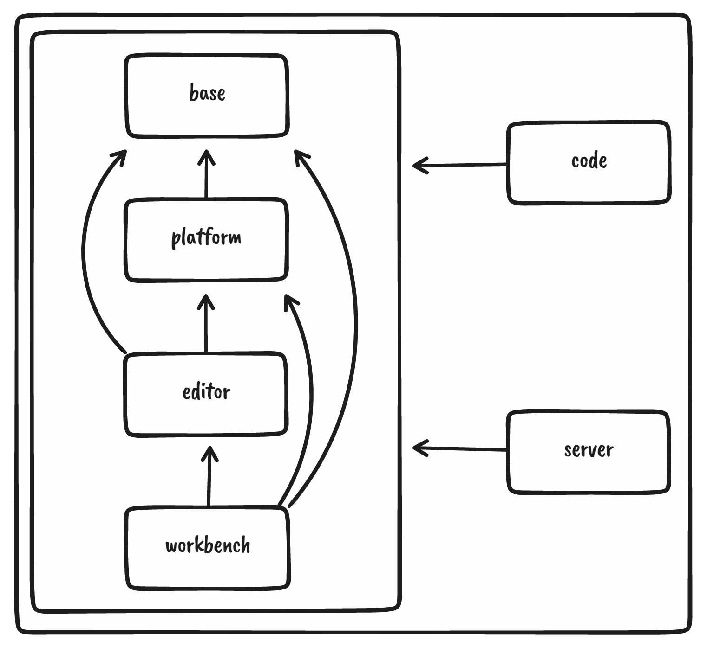
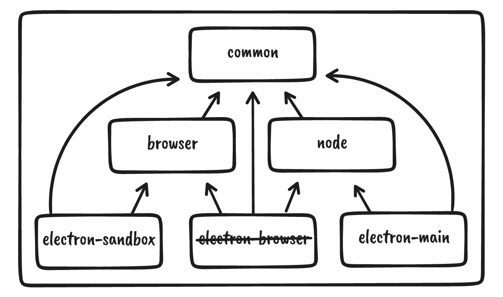

Visual Studio Code consists of a layered and modular `core` (found as `src/vs`) that can be extended using extensions. Extensions are run in a separate process referred to as the
`extension host.` Extensions are implemented by utilising the [extension API](https://code.visualstudio.com/docs/extensions/overview). Built-in extensions can be found in the `extensions` folder.

# Layers

The `core` is partitioned into the following layers:
- `base`: Provides general utilities and user interface building blocks that can be used in any other layer.
- `platform`: Defines service injection support and the base services for VS Code that are shared across layers such as `workbench` and `code`. Should not include `editor` or `workbench` specific services or code.
- `editor`: The "Monaco" editor is available as a [separate downloadable](https://microsoft.github.io/monaco-editor/) component.
- `workbench`: Hosts the "Monaco" editor, notebooks and custom editors and provides the framework for panels like the Explorer, Status Bar, or Menu Bar, leveraging [Electron](https://www.electronjs.org/) to implement the VS Code desktop application and browser APIs to provide VS Code for the Web.
- `code`: The entry point to the desktop app that stitches everything together, this includes the Electron main file, shared process, and the CLI for example.
- `server`: The entry point to our server app for remote development.

<div align="center">

</div>

# Target Environments
The `core` of VS Code is fully implemented in [TypeScript](https://github.com/microsoft/typescript). Inside each layer the code is organised by the target runtime environment. This ensures that only the runtime specific APIs are used. In the code we distinguish between the following target environments:
- `common`: Source code that only requires basic JavaScript APIs and run in all the other target environments
- `browser`: Source code that requires [Web APIs](https://developer.mozilla.org/en-US/docs/Web/API), eg. DOM
  - may use code from: `common`
- `node`: Source code that requires [Node.JS](https://nodejs.org) APIs
  - may use code from: `common`
- `electron-sandbox`: Source code that requires the `browser` APIs like access to the DOM and a small subset of APIs to communicate with the Electron main process (anything exposed from `src/vs/base/parts/sandbox/electron-sandbox/globals.ts`
  - may use code from: `common`, `browser`, `electron-sandbox`
- `electron-utility`: Source code that requires the [Electron utility-process](https://github.com/electron/electron/blob/main/lib/utility/api/module-list.ts) APIs
  - may use code from: `common`, `node`
- `electron-main`: Source code that requires the [Electron main-process](https://github.com/atom/electron/tree/master/docs#modules-for-the-main-process) APIs
  - may use code from: `common`, `node`, `electron-utility`

<div align="center">

</div>

# Dependency Injection

## Consuming a service

The code is organised around services of which most are defined in the `platform` layer. Services get to its clients via `constructor injection`. 

A service definition is two parts: (1) the interface of a service, and (2) a service identifier - the latter is required because TypeScript doesn't use nominal but structural typing. A service identifier is a decoration (as proposed for ES7) and should have the same name as the service interface. 

Declaring a service dependency happens by adding a corresponding decoration to a constructor argument. In the snippet below `@IModelService` is the service identifier decoration and `IModelService` is the (optional) type annotation for this argument. 

```javascript
class Client {
  constructor(
    @IModelService modelService: IModelService
  ) {
    // use services
  }
}
```

Use the instantiation service to create instances for service consumers, like so `instantiationService.createInstance(Client)`. Usually, this is done for you when being registered as a contribution, like a Viewlet or Language.

## Providing a service

The best way to provide a service to others or to your own components is the `registerSingleton`-function. It takes a service identifier and a service constructor function. 

```javascript

registerSingleton(
  ISymbolNavigationService, // identifier
  SymbolNavigationService,  // ctor of an implementation
  InstantiationType.Delayed // delay instantiation of this service until is actually needed
);
```

Add this call into a module-scope so that it is executed during startup. The workbench will then know this service and be able to pass it onto consumers.

# VS Code Editor source organisation

* the `vs/editor` folder should not have any `node` or `electron-*` dependencies.
* `vs/editor/common` and `vs/editor/browser` - the code editor core (critical code without which an editor does not make sense).
* `vs/editor/contrib` - code editor contributions that ship in both VS Code and the standalone editor. They depend on `browser` by convention and an editor can be crafted without them which results in the feature brought in being removed.
* `vs/editor/standalone` - code that ships only with the standalone editor. Nothing else should depend on `vs/editor/standalone`
* `vs/workbench/contrib/codeEditor` - code editor contributions that ship in VS Code.

# VS Code Workbench source organisation

The VS Code workbench (`vs/workbench`) is composed of many things to provide a rich development experience. Examples include full text search, integrated git and debug. At its core, the workbench does not have direct dependencies to all these contributions. Instead, we use an internal (as opposed to real extension API) mechanism to contribute these contributions to the workbench. 

In a nutshell, folders are organised as:
* `vs/workbench/{common|browser|electron-sandbox}`: workbench core that is as minimal as possible
* `vs/workbench/api`: the provider of the `vscode.d.ts` API (both extension host and workbench implementations)
* `vs/workbench/services`: workbench core services (should NOT include services that are only used in `vs/workbench/contrib`)
* `vs/workbench/contrib`: workbench contributions (this is where most of your code should live, see below)

Contributions that are contributed to the workbench all live inside the `vs/workbench/contrib` folder. There are some rules around the `vs/workbench/contrib` folder:
- there cannot be any dependency from outside `vs/workbench/contrib` into `vs/workbench/contrib`
- every contribution should have a single `.contribution.ts` file (e.g. `vs/workbench/contrib/search/browser/search.contribution.ts`) to be added to the main entry points for the product (see last paragraph for details)
  - if you add a new service which is only used from one `contrib` and not other components or workbench core, it is recommended to register the service from the `contrib` entrypoint file
- every contribution should expose its internal API from a single file (e.g. `vs/workbench/contrib/search/common/search.ts`)
- a contribution is allowed to depend on the internal API of another contribution (e.g. the git contribution may depend on  `vs/workbench/contrib/search/common/search.ts`)
- a contribution should never reach into the internals of another contribution (internal is anything inside a contribution that is not in the single common API file)
- think twice before letting a contribution depend on another contribution: is that really needed and does it make sense? Can the dependency be avoided by using the workbench extensibility story maybe?

# VS Code for Desktop / VS Code for Web

We ship both to desktop via Electron and to the Web with the goal to share as much code as possible in both environments. Writing code that only runs in the one environment should be the exception, think twice before going down that path. Ideally the same code can run in both environments.

To distinguish the environments in the product we build, there are entry files that define all the dependencies depending on the environment:
* `src/vs/workbench/workbench.desktop.main.ts`: for desktop only dependencies
* `src/vs/workbench/workbench.web.main.ts`: for web only dependencies

Both depend on our core entry file:
* `src/vs/workbench/workbench.common.main.ts`: for shared dependencies

Here are some rules that apply:
* code that is shared should go into `workbench.common.main.ts`
* code that is web only should go into `workbench.web.main.ts`
* code that is desktop only should go into `workbench.desktop.main.ts`

Be careful when introducing a service only for the desktop and not for the web: code that runs in the web that requires the service will fail to execute if you do not provide a related service for web. It is fine to ship two different implementations of a service when you use different strategies depending on the environment.

Note: Only code that is referenced from the main entry files is loaded into the product. If you have a file that is otherwise not referenced in your code, make sure to add the import to your `.contribution.ts` file.
