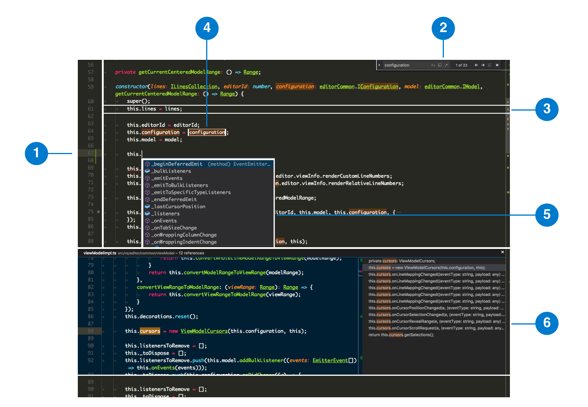

- [ ] Overview
- [x] Model-View-ViewModel in Monaco
- [ ] User Interactions
    - [ ] Key Handler
    - [ ] Mouse or Touch
    - [ ] Commands
- [ ] Life Cycle
- [ ] Render Performance
- [ ] Deep into the text
    - [x] Indentation
    - [ ] Markers
    - [ ] Decorations
    - [ ] Tokens and Themes
- [ ] Extensibility
- [ ] Patterns and Principles

# Overview

## Code structure
Like other parts of VS Code, the code is organized by the target runtime environment in Monaco. We distinguish between the following target environments

```
|-- editor
|	|-- browser				// source code that requires the browser APIs like access to the DOM
|	|-- common				// the core part of the editor, source code that only requires basic JavaScript APIs and run in all the other target environments
|	|-- contrib				// first class *extensions* of the editor
|	|-- electron-browser 	// source code that requires the Electron renderer-process APIs
|	|-- node				// source code that requires nodejs APIs
|	|-- test
```


# Model-View-ViewModel in Monaco

Although we don't adopt any framework during the development, Monaco's design finally turns out to be MVVM (Model-View-ViewModel). With this design pattern in mind, we can simply separate components in the core into three layers:

* View: User interface. It display information to users (Text, Cursor, Selection, etc) and handle user interactions. The View elements here are actually HTML DOM nodes.
* Model: Provides a view-independent representation of business entities. In Monaco, it usually represents the file you are editing.
* ViewModel: The bridge between the View and the Model. It retrieves data from the Model and manipulates it into the format required by the View. A good **example** to help understand ViewModel is that `\t` is always a single character in Model while it takes several columns in ViewModel and it's determined by option `tabSize`.

Here we'd like to take the outside-in approach to describe the architecture of Monaco, the relationship and dependencies of different components and even the source code structure, from [View](#view) to [ViewModel](#viewmodel) then finally [Model](#model).

## View



Above is what users usually see while working on source code files. This particular view is a CodeEditorWidget and it consists of multiple view parts, including but not limited to:


1. *Line Numbers*
2. *View Zone*: The Find All Reference is a View Zone which is a full horizontal rectangle that **pushes** text down. The editor reserves space for view zones when rendering, that's why the line before the widget is no.88 and the one after is no.89.
3. *ViewLine*. Each line of text is a ViewLine.
4. *Decorations*: Word highlights are Decorations
5. *Content Widget*: The Suggestion Widget is a Content Widget which renders inline with the text and can be easily placed **near** an editor position.
6. *Overlay Widget*: The Find widget is an Overlay Widget, which renders on top of the text.
7. ...

For the sake of performance and memory, our rendering process will only render the view elements (which are DOM elements) whenever necessary ideally. Besides, all these view elements will listen to related events occur in the ViewModel and rerender when there is real view change.

For instance, the suggestion list will change constantly when users type but we just make changes to the DOM node generate by Cursors and the Suggestion Widget. Word Highlight Decorations might have some updates as well but we will do some dirty check to see if it's necessary. For other parts like the Find All References Widget, Find Widget, etc, they just stay where they were so no View redraw is happening.

Since these components are general and browser related, we put them in `/vs/editor/browser` and right now we have around 20 basic view parts in the core.

```
editor
|-- browser
|   |-- ...
|   |-- viewParts
|   |   |-- contentWidgets
|   |   |-- currentLineHighlight
|   |   |-- ...
|   |   |-- decorations
|   |   |-- ...
|   |   |-- overlayWidgets
|   |   |-- ...
```

One thing to note is that all these basic view parts are not bound to any particular feature. When we want to create a view component which may be composed of several different view parts and has its special business logic and view updating mechanism, we can extend from basic view parts and put it under `/vs/editor/contrib/` (aka first class extensions to the editor). For example, the Find Widget listens to the content change in the search box and the editor and consists of a Content Widget and multiple decorations.


## ViewModel
If we are developing a simple application, it's natural to bind Model directly to the View if the mapping is clear and easy to handle, like a boolean in the model can be data bound to a CheckBox in the View or an array can be bound to a dropdown list. You can even choose to make it two-way data binding or just simply one-way.

However real world applications are usually more complex than that. The Model is very likely to have types that can't be directly mapped to visual elements (can you imagine that you have to take HTML Elements into account while designing the data structure?) and the View may perform complex operations that don't necessarily modify the model. That's basically why we need ViewModel here.

In Monaco, the View has no direct way of talking to the Model. Instead it asks ViewModel for data or events, and informs the ViewModel about user actions. So the ViewModel contains the reference to the Model, the state of the View, event handlers and distributors, and transformers that can convert Model data to View info and vice versa.

We can take a look at the interface of ViewModel in Monaco to grasp a better idea

```
export interface IViewModel extends IEventEmitter {
	getTabSize(): number;
	getLineCount(): number;
	mightContainRTL(): boolean;
	mightContainNonBasicASCII(): boolean;
	getLineContent(lineNumber: number): string;
	getLineIndentGuide(lineNumber: number): number;
	...
	getSelections(): Selection[];

	// View -> Model conversion and related methods
	convertViewPositionToModelPosition(viewLineNumber: number, viewColumn: number): Position;
	convertViewRangeToModelRange(viewRange: Range): Range;

	// Model -> View conversion and related methods
	getModelLineContent(lineNumber: number): string;
	getModelLineMaxColumn(modelLineNumber: number): number;
	validateModelPosition(position: IPosition): Position;
	convertModelPositionToViewPosition(modelLineNumber: number, modelColumn: number): Position;
	convertModelSelectionToViewSelection(modelSelection: Selection): Selection;
	modelPositionIsVisible(position: Position): boolean;
}
```

The first half methods are wrappers of Model, Editor configuration and View state. The second half are converters of View and Model info. Remember the first example of tab and column width we mentioned at the beginning of this topic? `convertModelPositionToViewPosition` and its counterpart `convertViewRangeToModelRange` are the right methods to call and they sit in the ViewModel but not other layers.

Besides, both Model and ViewModel are implemented as `EventEmitter`, which allows us to handle events with ease.

## Model
Model is the data and business logic, which is completely UI independent. To some extent, it's the core part of Monaco editor. It holds content and metadata of files, tokens and markers which provide a language-specific, structured representation of plain text, decorations for customized visual effect metadata, etc.

Monaco has a rich extensibility model and you can extend it in many ways. However, we do not provide direct access to the View or ViewModel to extensions. We are continually trying to optimize use of the underlying web technologies to deliver an always available, highly responsive editor and we will continue to tune our use of the DOM as these technologies and our product evolve. To maintain performance and compatibility, we run extensions in their own host process and prevent direct access to the View related information. Instead we feed extensions with Model which is more stable and very unlikely to change vastly and break external extensions.

Monaco already includes a built-in set of UI components for common scenarios such as IntelliSense, so that these experiences are consistent across programming languages and extensions and extension developers do not need to build their own. These UI components are mostly put in `/vs/editor/contrib/` and that's the place we should go if we want to add new UI components which are good to have in the editor but not fundamental to the core.
